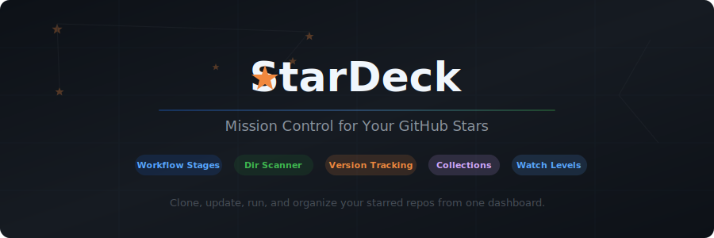
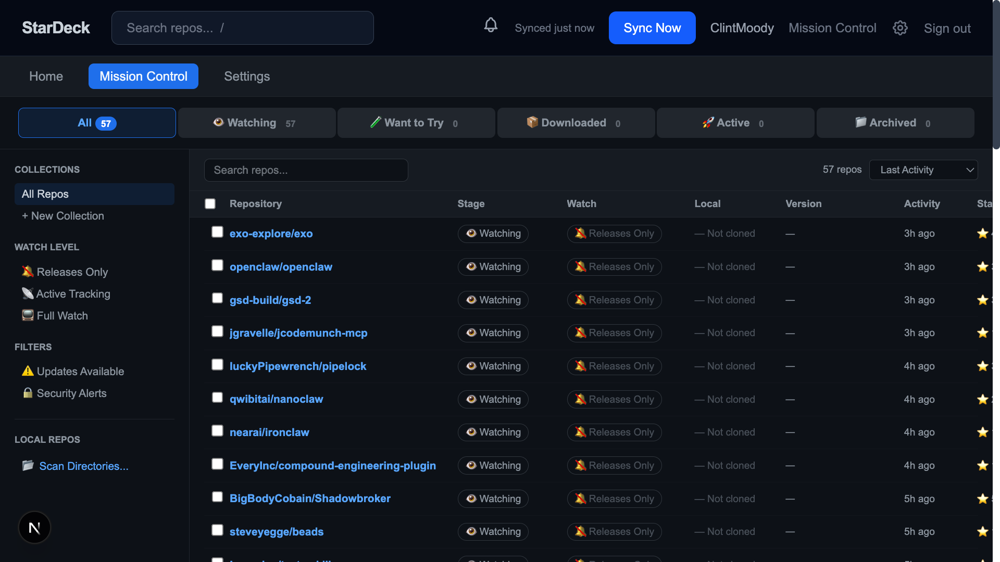

<p align="center">
  
</p>

<p align="center">
  <strong>Clone, update, run, and organize your starred GitHub repos from one dashboard.</strong>
</p>

<p align="center">
  
  
  
  
  
</p>

---

## The Problem

You star a lot of GitHub repos. Some you want to download. Some you just want to keep an eye on. Some you've already cloned somewhere on your machine but can't remember where. There's no good way to:

- **Track what you've downloaded** vs. what you're just watching
- **Know if your local copies are outdated** without checking each one manually
- **Find repos you've already cloned** across scattered directories
- **Organize repos by intent** (trying out, actively using, archived, etc.)
- **Update a cloned repo** without remembering the exact commands

## The Solution

StarDeck syncs your GitHub stars into a local dashboard with two views:

- **Home** — a browsable, categorized view for discovering what's in your collection
- **Mission Control** — a dense, sortable command center for managing everything

<p align="center">
  
</p>

---

## Features

<table>
<tr>
<td width="50%" valign="top">

### Workflow Pipeline
Every repo lives in a stage: **Watching** &rarr; **Want to Try** &rarr; **Downloaded** &rarr; **Active** &rarr; **Archived**. Change stages with an inline dropdown. Repos auto-advance when you clone or run them.

### Directory Scanner
Point StarDeck at your folders. It scans for `.git` directories, reads remote URLs, and auto-matches them to your starred repos. Browse folders visually — no typing paths.

### Version Comparison
See at a glance if your local copy is behind. Compares release tags when available, falls back to commit SHA comparison. One-click smart pull with stash/pop for dirty repos.

### Watch Levels
Set per-repo attention: **Releases Only**, **Active Tracking**, or **Full Watch**. Controls what activity you get notified about.

</td>
<td width="50%" valign="top">

### Collections
Create custom groups (AI Tools, Security, Music Production) with optional auto-rules that sort new stars automatically based on topics or language.

### Clone, Run, Update
Clone any starred repo with one click. Auto-detects project type (npm, Python, Rust, etc.) and suggests install/run commands. Smart pull updates with local change protection.

### Bulk Operations
Select multiple repos and batch-change stages, watch levels, or trigger bulk updates. Shift-select ranges, select all, or cherry-pick.

### Resizable Table
Every column in Mission Control is drag-resizable. Sort by activity, stars, disk usage, name, or date starred. Search across all repos instantly.

</td>
</tr>
</table>

---

## Quick Start

### Prerequisites

- Node.js 18+
- A GitHub account (for OAuth and API access)
- A [GitHub OAuth App](https://github.com/settings/developers) (for authentication)

### Setup

```bash
git clone https://github.com/ClintMoody/StarDeck.git
cd StarDeck
npm install
```

Create `.env.local`:

```env
GITHUB_CLIENT_ID=your_github_oauth_client_id
GITHUB_CLIENT_SECRET=your_github_oauth_client_secret
NEXTAUTH_SECRET=generate-a-random-secret-here
NEXTAUTH_URL=http://localhost:3000
CLONE_DIRECTORY=~/stardeck-repos
```

> **Getting GitHub OAuth credentials:** Go to [GitHub Developer Settings](https://github.com/settings/developers) &rarr; OAuth Apps &rarr; New OAuth App. Set the callback URL to `http://localhost:3000/api/auth/callback/github`.

### Run

```bash
npm run dev
```

Open [http://localhost:3000](http://localhost:3000), sign in with GitHub, and click **Sync Now** to pull your starred repos.

### Self-Hosted Production

```bash
npm run build
npm start
```

The SQLite database (`stardeck.db`) is created automatically in the project root. Back it up to preserve your data.

---

## Architecture

```
StarDeck
├── src/app/                    # Next.js 16 App Router
│   ├── page.tsx               # Home — categorized browse view
│   ├── mission-control/       # Mission Control — management table
│   ├── settings/              # Settings page
│   ├── repo/[owner]/[name]/   # Repo detail pages
│   └── api/                   # 30 API routes
├── src/components/
│   ├── dashboard/             # Home view components
│   ├── mission-control/       # MC table, sidebar, pipeline, dropdowns
│   ├── detail/                # Repo detail tabs
│   └── settings/              # Settings panels
├── src/lib/
│   ├── db/schema.ts           # Drizzle ORM schema (19 tables)
│   ├── queries.ts             # Data access layer
│   ├── scanner.ts             # Directory scanner + git remote parser
│   ├── version-check.ts       # Local vs remote version comparison
│   ├── sync.ts                # GitHub API sync
│   └── process-manager.ts     # Clone/run process management
├── tests/                     # Vitest test suite
├── drizzle/                   # Database migrations
└── stardeck.db                # SQLite database (auto-created)
```

**Stack:** Next.js 16 (App Router) + React 19 + TypeScript + Tailwind CSS 4 + Drizzle ORM + better-sqlite3 + NextAuth v5

---

## API Routes

| Endpoint | Methods | Purpose |
|----------|---------|---------|
| `/api/sync` | POST | Sync starred repos from GitHub |
| `/api/mission-control` | GET | Fetch repos with filtering/sorting |
| `/api/workflow-stage` | POST | Change workflow stage (bulk) |
| `/api/watch-level` | POST | Change watch level (bulk) |
| `/api/collections` | GET/POST/PUT/DELETE | Collection CRUD |
| `/api/collections/[id]/repos` | GET/POST/DELETE | Collection membership |
| `/api/scan` | POST | Trigger directory scan |
| `/api/scan/browse` | GET | Browse server-side directories |
| `/api/scan/directories` | GET/POST/DELETE | Manage scan directories |
| `/api/update-repo` | POST | Smart pull with stash/pop |
| `/api/version-check` | GET | Compare local vs remote version |
| `/api/clone` | POST | Clone a repo |
| `/api/run` | POST | Run a cloned repo |
| `/api/stop` | POST | Stop a running process |
| `/api/saved-views` | GET/POST/PUT/DELETE | Saved filter presets |

---

## Contributors

<a href="https://github.com/ClintMoody">
  
  <br/>
  <sub><b>Clint Moody</b></sub>
</a>

---

## License

MIT
